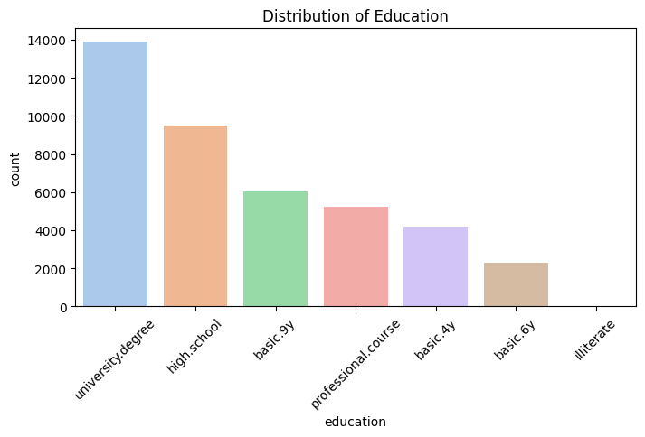
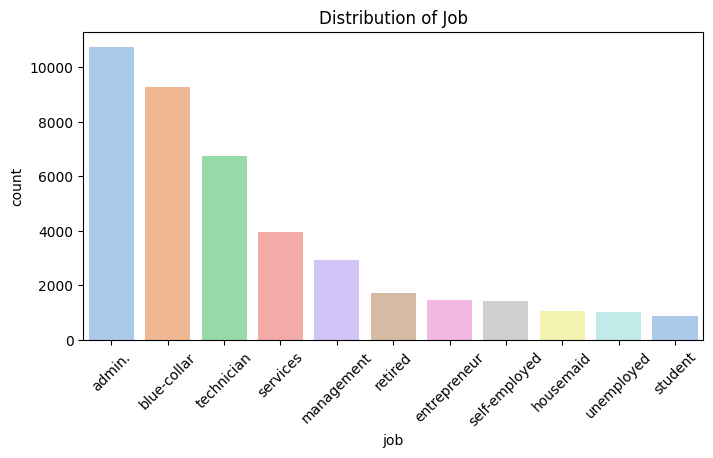
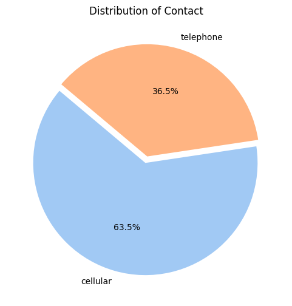
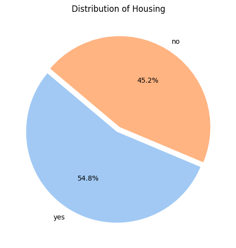
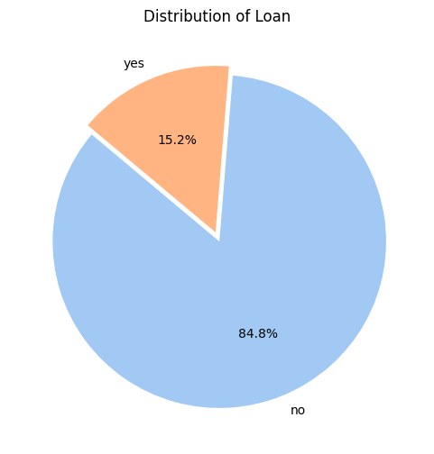
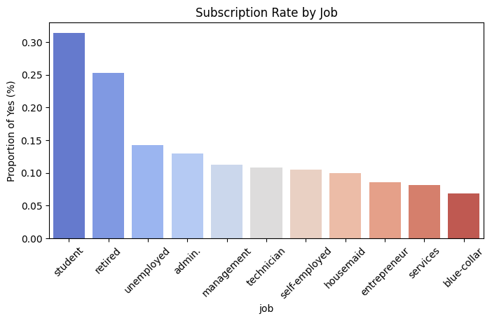
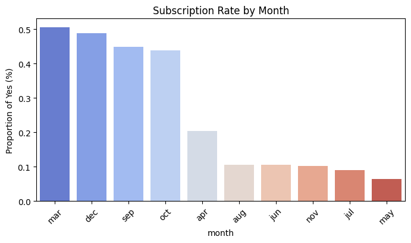
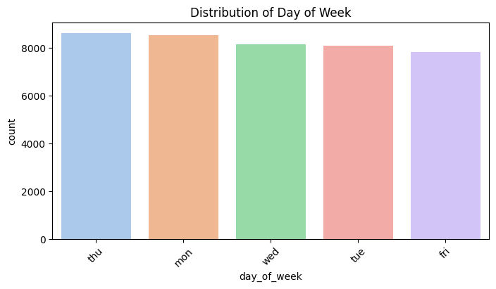
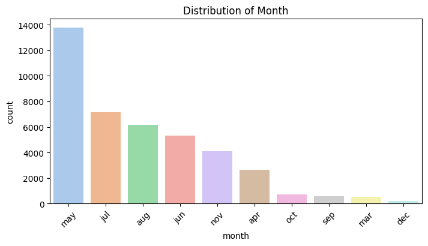

#  Overview

The goal of this project is to predict whether a bank customer will subscribe to a term deposit after a marketing campaign.
I used the Bank Marketing dataset from Kaggle, downloaded using the Kaggle API (henriqueyamahata/bank-marketing), which contains around 41,188 records and 21 features about customer demographics and campaign details.

After cleaning and exploring the data, I trained a Random Forest Classifier that achieved strong predictive accuracy.
Finally, I built a Flask web app, containerized it with Docker, and deployed it on Render for live predictions:

#### https://bank-marketing-oqbz.onrender.com/

#  Dataset Information

The dataset used in this project is the Bank Marketing dataset from Kaggle, originally sourced from a Portuguese bank’s marketing campaigns.
It contains details about customers, their personal and financial attributes, and the outcome of previous marketing contacts.
I downloaded it directly using the Kaggle API command below:
!kaggle datasets download -d henriqueyamahata/bank-marketing
The target column y indicates whether the customer subscribed to a term deposit (yes or no).

#  Technical Aspects

This project was built using **Python** and several key data science and deployment tools.  
Below are the main technical components involved in each phase of the project:

###  Data Analysis & Modeling
- **Libraries:** pandas, NumPy, scikit-learn, Matplotlib,Xgboost, joblib 
- **Algorithm:** Random Forest Classifier, Decision tree, XG Boost 
- **Model Tuning:** GridSearchCV for hyperparameter optimization  
- **Pipeline:** Combined preprocessing and model into a single workflow using `ColumnTransformer` and `Pipeline`
- **Evaluation Metrics:** accuracy_score, precision_score, recall_score, f1_score, classification_report, confusion_matrix  

###  Deployment
- **Framework:** Flask (for building the API)  
- **Containerization:** Docker (for packaging and running the app)  
- **Hosting Platform:** Render (for live deployment)  
 
# Visualisation 

