#  Overview

The goal of this project is to predict whether a bank customer will subscribe to a term deposit after a marketing campaign. The model is trained using the Bank Marketing dataset from Kaggle, downloaded via the Kaggle API (henriqueyamahata/bank-marketing). The dataset contains approximately 41,188 records with 21 features describing customer demographics, financial information, and campaign interactions.

After performing data cleaning, preprocessing, and exploratory analysis, several machine learning models were trained and evaluated, including Decision Trees, Random Forest, and XGBoost. Hyperparameter tuning was performed using GridSearchCV, and the final model was selected based on evaluation metrics such as precision, recall, F1-score, and overall accuracy.

The trained model is served through a Flask API, containerized using Docker, and deployed on Render for live predictions.

Live application:

#### [https://bank-marketing-oqbz.onrender.com/](https://bank-marketing-oqbz.onrender.com)

Beyond the core machine learning workflow, this project also focuses on building a reproducible and production-style ML pipeline. The training process is tracked with MLflow, data and pipeline stages are managed using DVC, and a CI/CD pipeline with GitHub Actions automatically runs linting, training, testing, and Docker image builds to ensure the system remains reliable and reproducible.

#  Technical Aspects

This project was built using **Python** and several key data science and deployment tools.  
Below are the main technical components involved in each phase of the project:

###  Data Analysis & Modeling
- **Libraries:** pandas, NumPy, scikit-learn, Matplotlib,Xgboost, joblib 
- **Algorithm:** Random Forest Classifier, Decision tree, XG Boost 
- **Model Tuning:** GridSearchCV for hyperparameter optimization 
- **Pipeline:** Combined preprocessing and model into a single workflow using `ColumnTransformer` and `Pipeline`
- **Evaluation Metrics:** accuracy_score, precision_score, recall_score, f1_score, classification_report, confusion_matrix

#  MLOps & Reproducibility

To make the project closer to a production-grade ML system, several MLOps practices were implemented:

- **Experiment Tracking**

MLflow is used to track multiple model experiments, parameters, and evaluation metrics. This allows comparison between models and ensures reproducibility of training runs.

- **Data Versioning**

DVC (Data Version Control) is used to manage datasets and the training pipeline. The DVC pipeline automates model training and ensures that changes in data or code trigger reproducible training runs.

- **Continuous Integration**

GitHub Actions is used to automatically validate the project whenever code is pushed. The CI pipeline performs:

- Code linting using flake8
- Pipeline execution using `dvc repro`
- API tests using pytest
- Docker image build verification

- **Containerization**

The application is packaged using Docker, ensuring that the environment, dependencies, and API service run consistently across machines.

- **Deployment**

The containerized Flask application is deployed on Render, allowing users to interact with the trained model through a live web interface.

#  Dataset Information

The dataset used in this project is the Bank Marketing dataset from Kaggle, originally sourced from a Portuguese bank’s marketing campaigns.
It contains details about customers, their personal and financial attributes, and the outcome of previous marketing contacts.
I downloaded it directly using the Kaggle API command below:
!kaggle datasets download -d henriqueyamahata/bank-marketing
The target column y indicates whether the customer subscribed to a term deposit (yes or no).

#  Deployment

Framework: Flask (REST API for predictions)  
Containerization: Docker (environment consistency)  
Hosting Platform: Render 

 
# Visualisation 

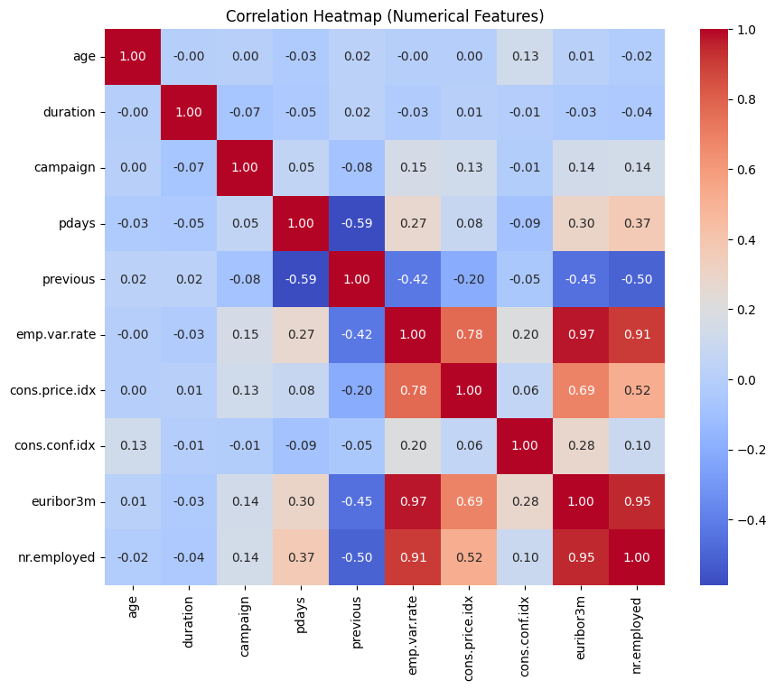
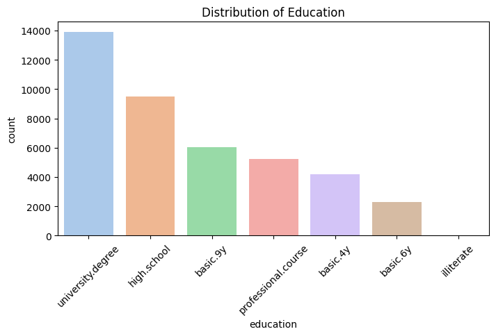
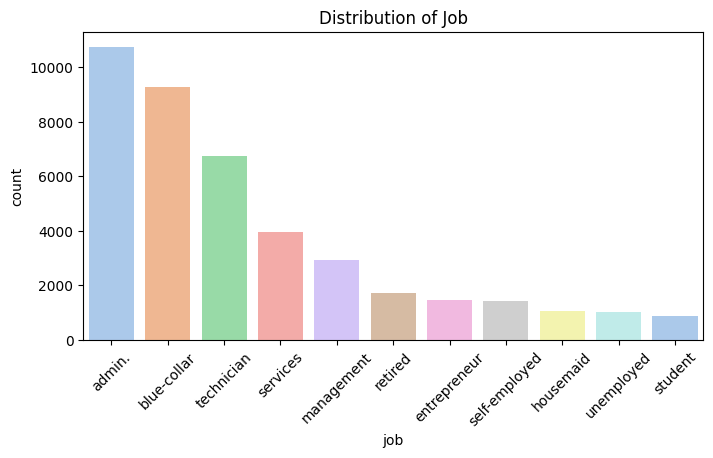
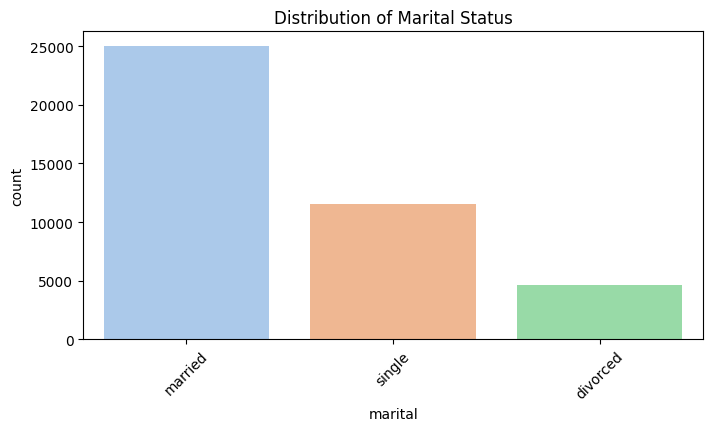
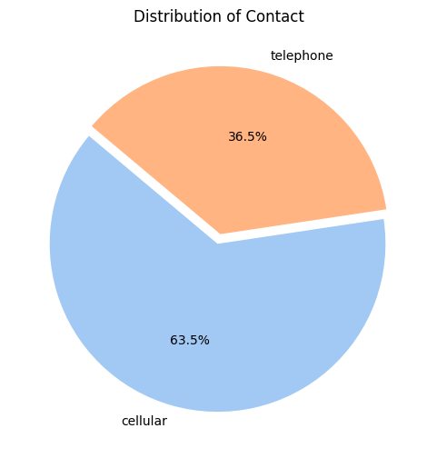
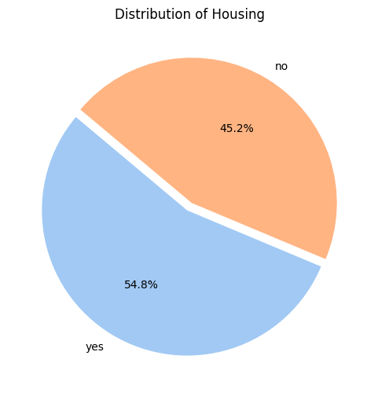
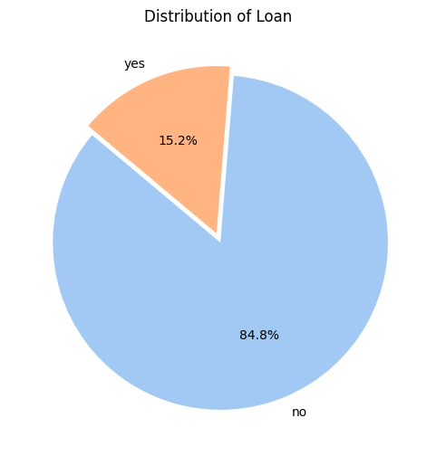
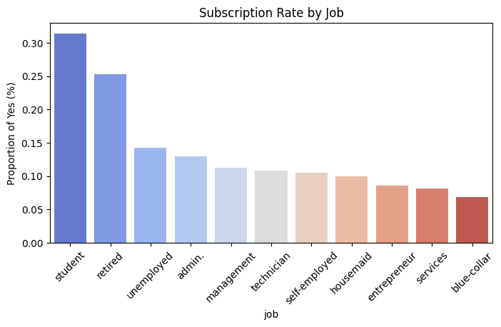
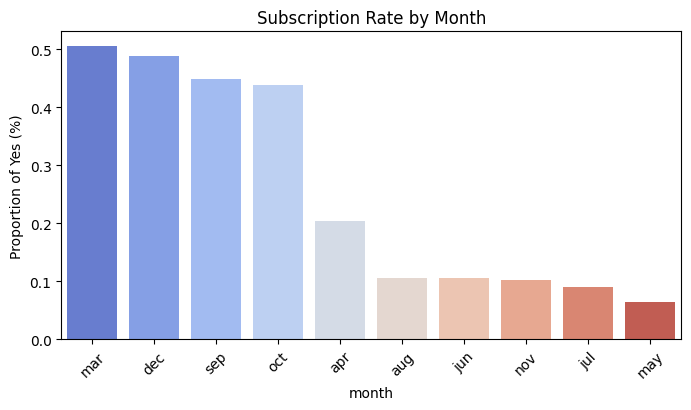
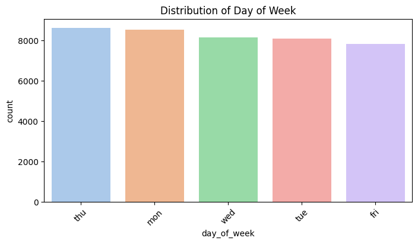
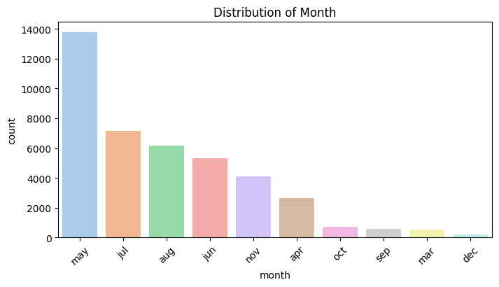
